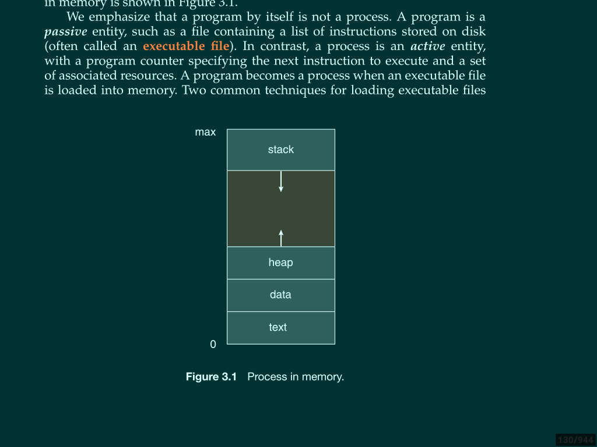
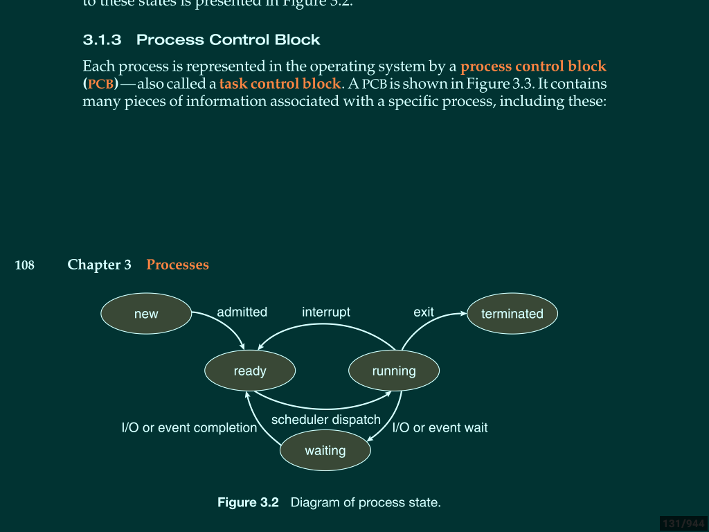
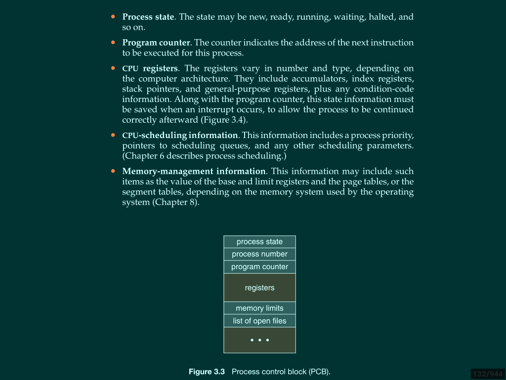
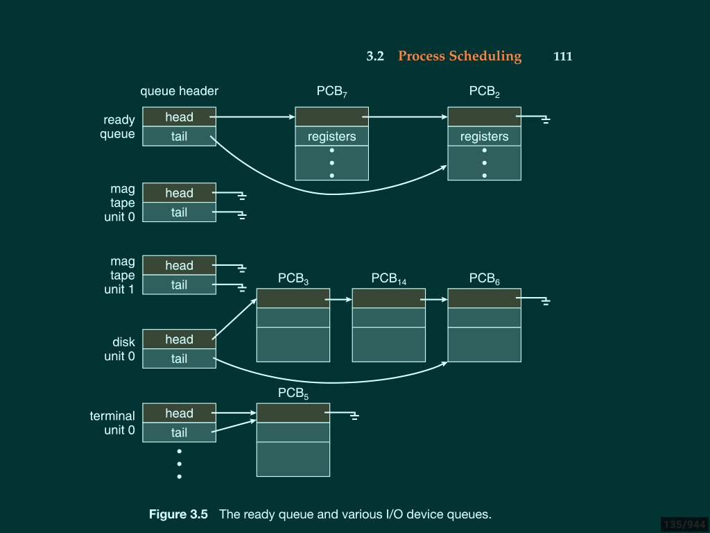
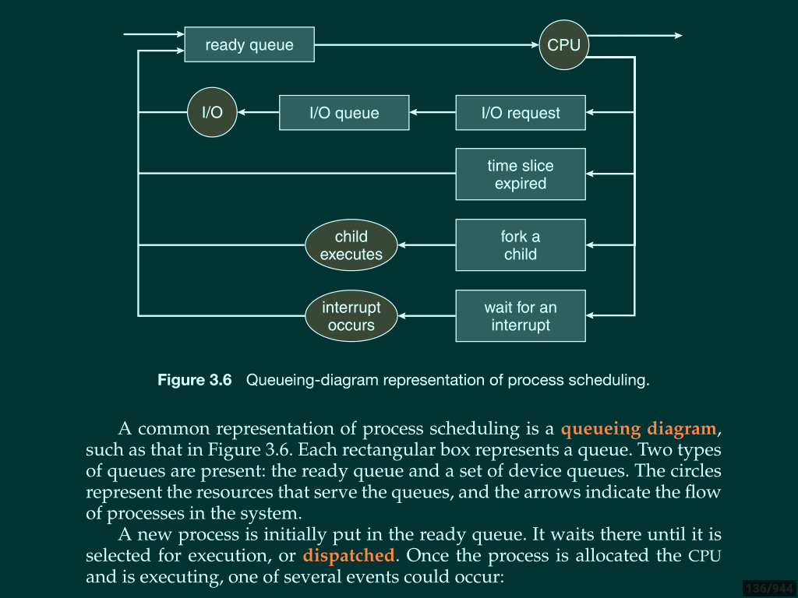
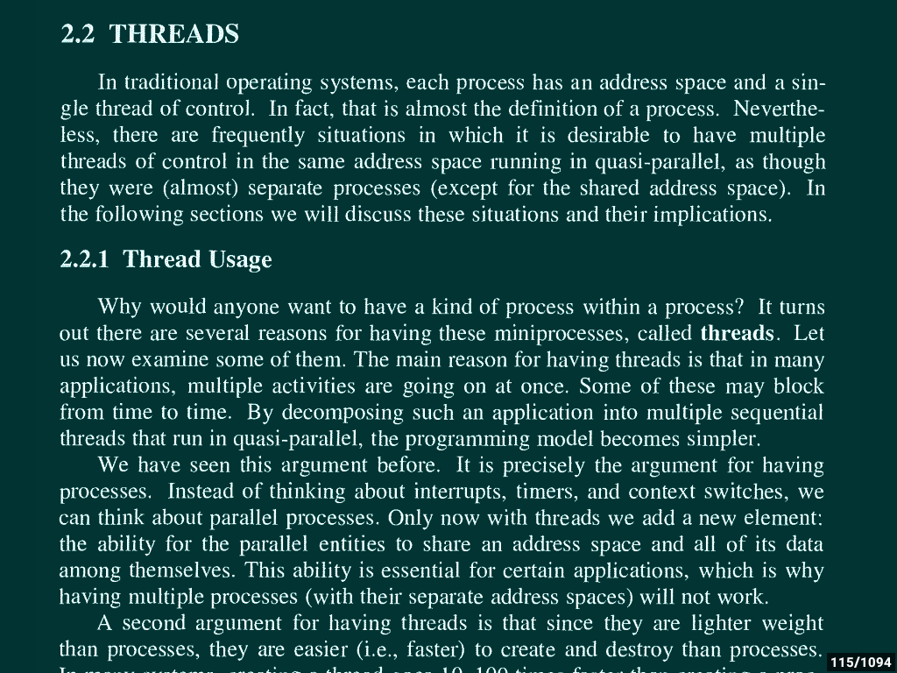
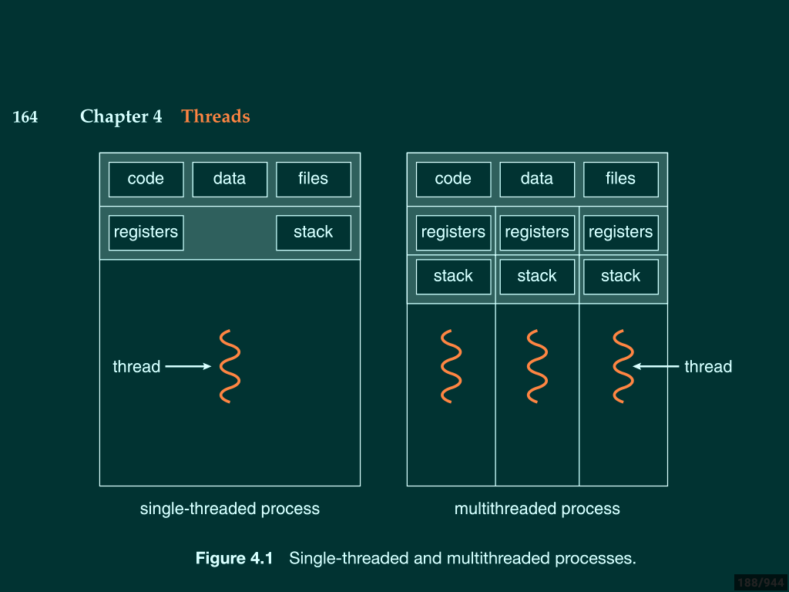
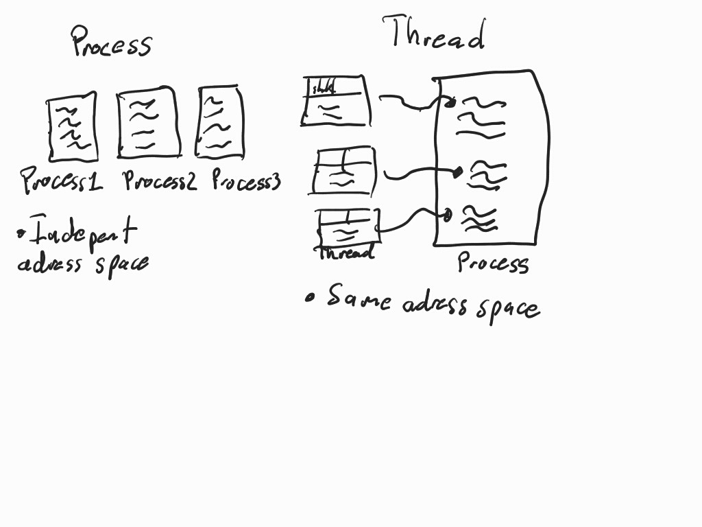

>> Freedom is the power to decide what your computer does, and the only way to have this freedom is to know what your computer is doing.

# Planificadores
------------------------------------
1.- Planificador FCFS (First-come, First-serverd)
(First-come, First-Served) “primer proceso en llegar - primero en ser atendido”.

2.- Planificación SJF  Shortest-Job-First
Shortest-Job-First, “primero al proceso con ráfaga más corta”.

3.- Planificación por prioridad (Numero 10 propioridad mas alta, numero 1 prioridad baja)

4.- Planificación Round Robin (RR)
A cada proceso se le asocia un quantum de tiempo de CPU.

----------------------------------------------
* Cooperativo

Si esta un proceso de tamaño 4 ejecutandose en la CPU y llega uno de tamaño 1 entonces no lo va apropiar, se va formar al inicio de la cola. No se va apropiar el procesador.

* Apropiativo

Si esta en ejecucion un proceso y llega uno con una prioridad más alta, le quita
al procesador y se apropia del procesador.

------------------------------------------------
# Operaciones
Tiempo de espera = Tsubio - Tllego - Tlleva ejecutandose.

Tiempo de ejecucion = Ttermino - Tllego.

Tiempo de respuesta = Tsubio por primera vez - Tllego.

-------------------------------------
## Projects

## [Backups](https://github.com/GuillermoGAndres/Operating-systems/tree/main/projectBackups)

Generador de backups, el proceso padre genera un proceso hijo para dividr las tareas y hacerlo de manera concurrente, el padre se encarga se buscar la carpeta a respaldar y le pasa los nombres de los archivos a su proceso hijo para que se encargue de generar una copia exacta y depositarlo en la carpeta destino indicada por el usuario.

## [Proccess Managment](https://github.com/GuillermoGAndres/Operating-systems/tree/main/projectProcessManagement)

Simulador de corto y mediano plazo de un gestor de procesos.

---
## Theory

## Process 
Los procesos creados con la llamada fork son denominados como **procesos pesados**,
estos procesos son programas *completos* e *independientes* con sus propias **variables, stack y memoria reservada**, lo unico que se comparte con el proceso original es el *codigo*.

Un proceso es mas que un codigo de un programa, un proceso incluye una **seccion de codigo, contador de programa, stack, section de datos y  un heap** que es donde se encontrara la memoria que se creara dinamicamente. Un *programa* llega a ser un proceso cuando el archivo ejecutable es **cargado en la memoria principal**, en se preciso momento se convierte en un **proceso**.

## Estados de un procesos
Un proceso en ejecucion pasa por varios estados:

* __New__. El proceso es creado.
* __Running__. Las instrucciones estan siendo ejecutadas.
* __Waiting__. El proceso esta en espera de un evento(Tal como entrada o salida estandar).
* __Ready__. El proceso esta esperando para ser ejecutado por el procesador.
* __Terminated__. El proceso ha acabado su ejecucion.

## Bloque de control de procesos
Cada procesos es representado por el sistema operativo como un **bloque de control de proceso**, el cual esta definido como una estructura de datos que contiene toda la informacion del proceso, por cada proceso el sistema operativo lo representa de esta forma.

Cuando creamos un nuevo proceso con fork, creamos una nueva secuencia que se ejecuta *concurrentemente* con el proceso padre, pero no comparte las zonas de los datos y la comunicacion entre ellos es muy limitada. Por ello aparecen los **pipes** y los otros mecanismos de comunicacion entre procesos.

Para que cada proceso sea ejecutado por el procesador, primero se organizar la cantidad de procesos que llegan utilizando difentes tipos de colas para cada estado, nuestro procesos se van formando uno tras otro y dependiendo de nuestro despachador o planificador de corto plazon eligira que proceso debe entrar para ejecutarse. 

Como son miles de procesos que quieren entrar a ejecucion y ademas de que algunos requeriran dispositivos de entrada/salida, es natural que cada proceso vaya formandose en nueva cola para cada tarea en particular.

## Threads

## Creacion de procesos

## Tablas de multiplar por cada proceso

### References
---
Abraham Siberschatz, Operating System Concepts, ninth edition.

Andres S. Tanenbaum, Operating Systems Design and Implementation
