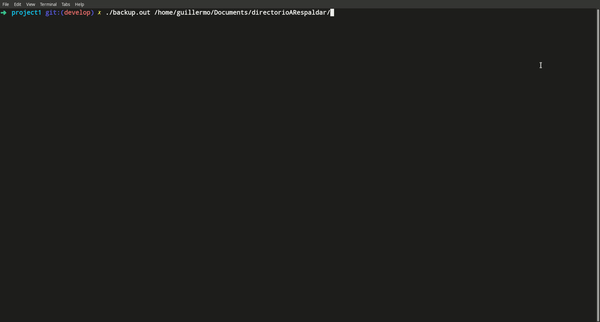

# Backups 

## Usage
~~~
./backup directorio_respadar directorio_destino
~~~
Las entradas pueden ser por:
* Entrada estandar (teclado)
* Por parametros 
* Por un archivo

Para el formato de entrada de archivos, puede ser entre entre espacios:
~~~
myFIle.txt
/home/user/Documents/DirectorioRespaldo  /home/user/Documents/DirectorioDestino
~~~
O puede ser tambien escritos sobre una new line(\n):
~~~
myFIle.txt
/home/user/Documents/DirectorioRespaldo
/home/user/Documents/DirectorioDestino
~~~
Las rutas puede ser relativas o absolutas.

## Compilacion
~~~
gcc backup.c -o backup
~~~
