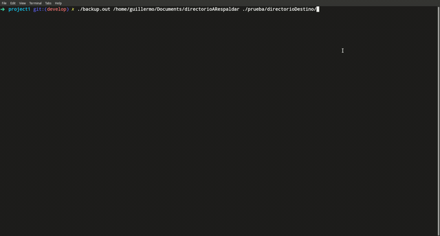

# Backups 

Generador de backups, el proceso padre genera un proceso hijo para dividr las tareas y hacerlo de manera concurrente, el padre se encarga se buscar la carpeta a respaldar y le pasa los nombres de los archivos a su proceso hijo para que se encargue de generar una copia exacta y depositarlo en la carpeta destino indicada por el usuario.

## Usage
~~~
./backup directorio_respadar directorio_destino
~~~

Las entradas pueden ser por:

* Entrada estandar (teclado)
* Por parametros 
* Por un archivo

Para el formato de entrada de archivos, puede ser entre entre espacios:
~~~
myFIle.txt
/home/user/Documents/DirectorioRespaldo  /home/user/Documents/DirectorioDestino
~~~
O puede ser tambien escritos sobre una new line(\n):
~~~
myFIle.txt
/home/user/Documents/DirectorioRespaldo
/home/user/Documents/DirectorioDestino
~~~
Las rutas puede ser relativas o absolutas.

<!--  -->

## Compilacion
~~~
gcc backup.c -o backup
~~~
Pudes eligira la extension que deses para tu ejecutable, es muy común que en sistemas operativos Windosws sea llamado backups.exe y en Linux backups.out, recordar que debe ser ejecutado en un entorno **Unix** para su funcionanmiento.
